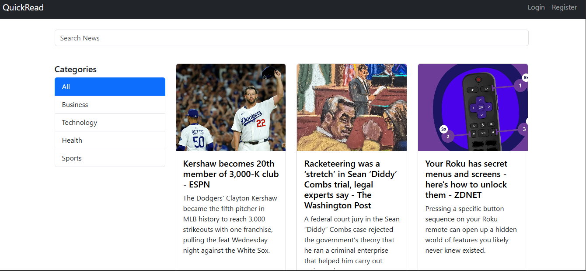
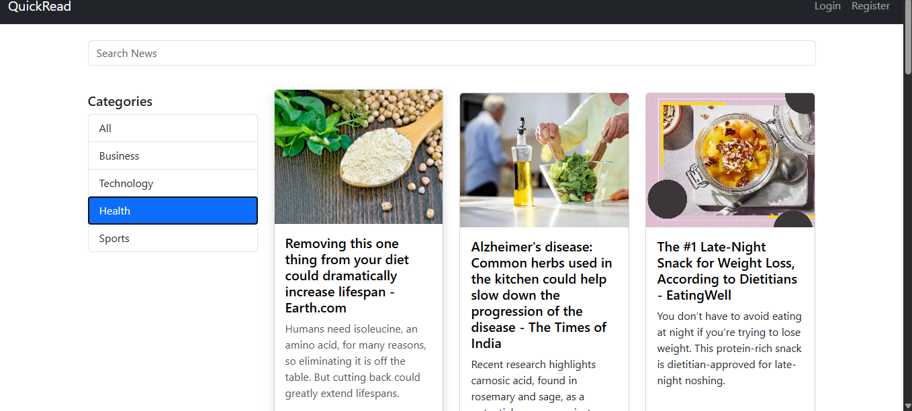
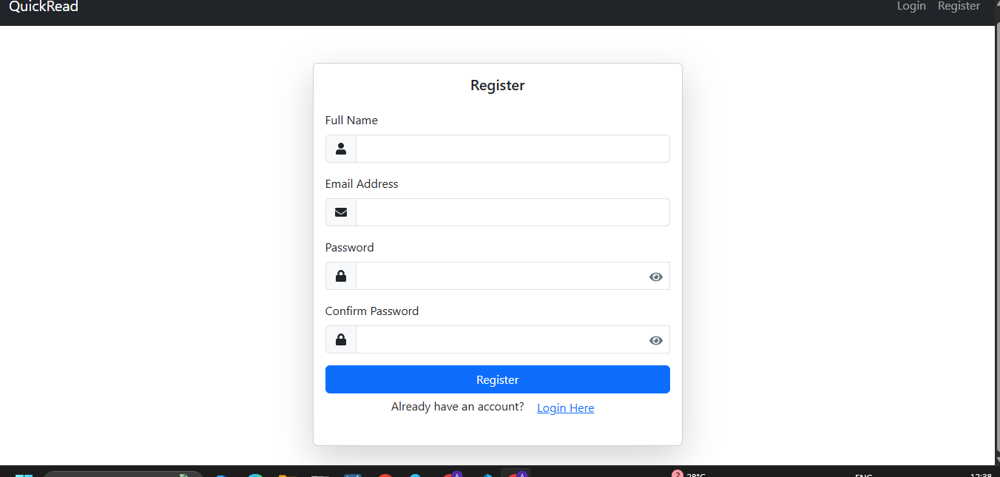
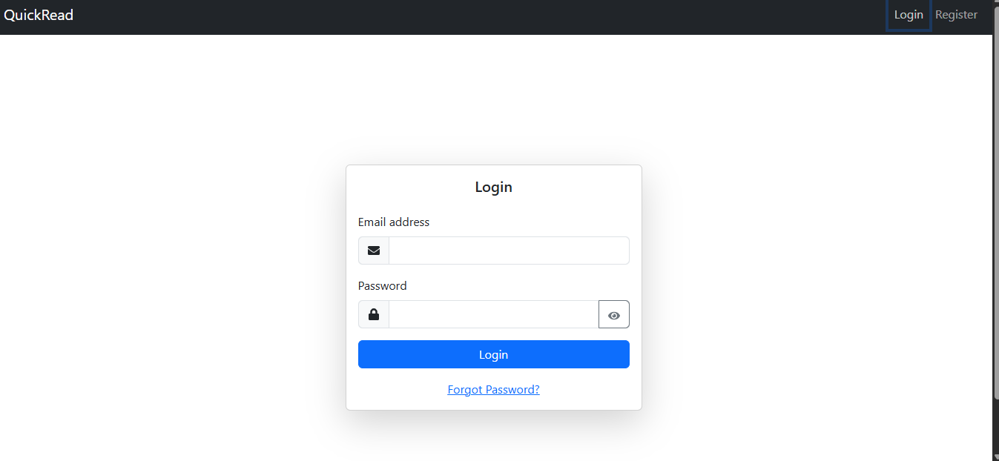
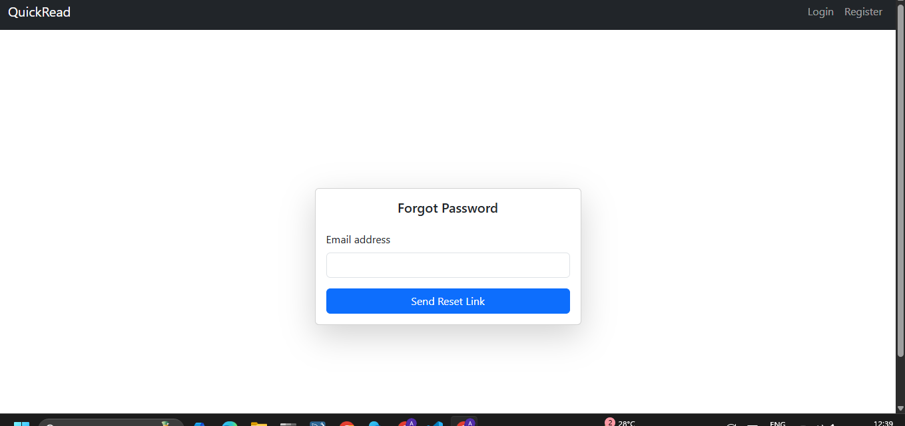
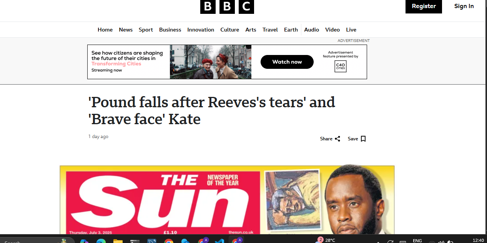

# 📰 QuickRead – News Aggregator Web App

QuickRead is a full-stack MERN-based news aggregation platform that delivers categorized news articles, allowing users to explore content based on their interests. The app supports search functionality, content sharing, detailed article views, and a secure password recovery system.

## 🚀 Key Features

- 🗂️ **Category-wise News Display**  
  Users can browse articles by categories such as Technology, Health, Sports, Business, and more to focus on what interests them most.

- 🔍 **Smart Interaction & User Features**  
  Includes detailed article views, keyword-based search, content sharing options, and a secure password recovery system.

- 💾 **Efficient Backend with MongoDB**  
  Utilized MongoDB for scalable and efficient storage of news and user data, enabling fast and reliable data access.

## 🛠 Tech Stack

### 🔹 Frontend
- React.js  
- React Router  
- Axios  
- Bootstrap / CSS Modules  

### 🔹 Backend
- Node.js  
- Express.js  
- MongoDB + Mongoose  
- RESTful APIs  
- JWT  

## 📸 Screenshots

### 🔹 Homepage

### 🔹 Category View

### 🔹 Register Page

### 🔹 Login Page

### 🔹 Forgot Password Page

### 🔹 Article Detail View

🙋‍♀️ Author
Aarti Pal – MCA Student & Full Stack Developer
GitHub: AartiPal2003